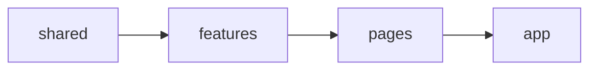

# Shopora: Fashion E-commerce Frontend


A modern, animated fashion e-commerce storefront built with **React, TypeScript and Tailwind CSS**. It is a **frontend-only** project: all product data lives in the codebase, so there is no backend or database to set up.

> **Live demo:** _add your deployed link here_

---

## Table of contents

- [About](#about)
- [Screenshots](#screenshots)
- [Features](#features)
- [Tech stack](#tech-stack)
- [Architecture](#architecture)
- [Routes](#routes)
- [Getting started](#getting-started)
- [Customizing the store](#customizing-the-store)
- [Project workflow](#project-workflow)
- [Roadmap](#roadmap)
- [Deployment](#deployment)
- [Notes](#notes)
- [Author](#author)
- [License](#license)

---

## About

Shopora is a fashion store UI inspired by the layouts of popular fashion and e-commerce sites. The goal of the project is to practice building a **real-world storefront** with a clean, scalable code structure and polished animations, while keeping every page data-driven so content can be changed without touching components.

What is built so far:

- A complete **home page** with banners, featured sections and category shortcuts
- A **mega menu** navbar with search, login/signup, wishlist and bag panels
- A reusable **collection page** that powers 16 different product listings
- A fully animated **footer** with newsletter form
- A custom **logo**, **favicon** and **404 page**

---

## Screenshots

> Add your screenshots to `docs/screenshots/` and update the paths below.

| Home | Mega menu |
|---|---|
|  |  |

| Collection page | Mobile view |
|---|---|
|  |  |

---

## Features

### Navigation and overlays

- **Sticky navbar** with a promo bar, animated logo and a sliding red underline on hover
- **Data-driven mega menu** (Men, Women, Kids, Beauty, Perfume) with staggered column animation
- **Search panel** that slides down from the top, with popular searches and live suggestions
- **Login / Sign up modal** with tabs, password show/hide and form validation (UI only)
- **Wishlist and Shopping Bag drawers** that slide in from the right, with empty states
- **Shared panel state:** the same panels open from the navbar icons and from the footer links, using a small React Context (`shared/panels`)
- **Animated mobile menu** with smooth height transitions

### Home page

- **Hero banners** with parallax scroll, scroll-reveal text and fully clickable banners
- **Featured section ("Shop the Edit"):** New Arrivals, Bestsellers and Accessories cards with live item counts
- **Trending Now** tiles (Perfume, Beauty, Varsity Jackets, Kids Clothes)
- **Seasonal banner** (Winter Wear)
- **Shop by Category** (Polo Shirts, Footwear, Trousers, Bags) with "Shop Women" and "Shop Men" deep links that open the page with the right tab selected
- **Feature cards** (Denim Edit, Signature Collection, Sport Edit)

### Collection pages

One generic page (`/collections/:slug`) renders every listing:

- Banner with breadcrumb, title and description
- **Filter tabs generated automatically** from the products in that collection (for example Boys/Girls for Kids, Makeup/Skincare/Haircare for Beauty)
- Animated product grid with layout animations when filtering
- **Product cards** with brand, price, struck-through original price, **% OFF**, **rating pill**, tags (New, Bestseller) and a wishlist heart
- **Aggregated pages** built from all products: **New Arrivals** (everything tagged New), **Bestsellers** (tagged Bestseller, sorted by reviews) and **Accessories**

### Footer

- Newsletter form with email validation, a shake animation on errors and an animated success state
- Six link groups, social icons that open in a new tab
- Account links (Login, Wishlist, Bag) open the same panels as the navbar
- Help, Company and Legal links lead to the 404 page (those pages are not built yet)
- Back-to-top button, floating background glow and a large wordmark

### Animation and accessibility

- Scroll-reveal, stagger, parallax, spring and layout animations powered by **Motion**
- One shared set of animation presets for a consistent feel
- Animated **404 page** and animated **logo** (the bag and the S draw themselves)
- Respects the user's **reduced motion** setting
- Keyboard friendly: `Esc` closes panels, proper `aria` labels and dialog roles

---

## Tech stack

| Purpose | Technology |
|---|---|
| UI library | React |
| Language | TypeScript |
| Build tool | Vite |
| Styling | Tailwind CSS |
| Animations | Motion (`motion/react`) |
| Routing | React Router (`react-router-dom`) |
| UI icons | lucide-react |
| Brand icons | react-icons |
| Version control | Git and GitHub |

---

## Architecture

The project is a **feature-based monolith**: one deployable app, with code grouped by feature instead of by file type. Each feature owns its components, data and types, and exposes a small public API through its `index.ts`.

### Folder structure

```
src/
├── app/                    App shell
│   ├── App.tsx             Router, providers and layout
│   └── PanelHost.tsx       Renders search, login, wishlist and bag panels once
├── pages/                  Thin pages that compose features
│   ├── HomePage.tsx
│   ├── CollectionPage.tsx
│   └── NotFoundPage.tsx
├── features/
│   ├── navbar/             Navbar, MegaMenu, nav data
│   ├── home/               Hero, tiles, category and feature cards, home content
│   ├── products/           ProductCard, CategoryFilter, collections data
│   ├── search/             SearchPanel
│   ├── auth/               AuthModal
│   ├── cart/               CartDrawer
│   ├── wishlist/           WishlistDrawer
│   └── footer/             Footer, link groups, newsletter form
└── shared/
    ├── animations/         Common animation presets
    ├── components/         Drawer, Modal, Logo, ScrollToTop
    ├── hooks/              useOverlay (Esc to close, scroll lock)
    └── panels/             Context, provider and hook for open panels
```

### Principles



1. **One-way imports:** `shared` → `features` → `pages` → `app`. Shared code never imports a feature.
2. **Public APIs only:** import from `@/features/home`, never from a feature's inner files.
3. **Thin pages:** pages only compose features and hold no business logic.
4. **Content separated from UI:** text, links and images live in `constants.ts`, `homeContent.ts` and `collections.ts`.
5. **Reusable building blocks** (Drawer, Modal, animation presets) live in `shared/`.
6. **Path alias:** `@/` points to `src/`.

---

## Routes

| Path | Page |
|---|---|
| `/` | Home |
| `/collections/:slug` | Collection page |
| `*` | 404 Not Found |

Available `slug` values:

| Group | Slugs |
|---|---|
| Featured | `new`, `bestsellers`, `accessories` |
| Trending | `perfume`, `beauty`, `varsity-jackets`, `kids` |
| Campaigns | `fall-2026`, `winter` |
| Categories | `polo-shirts`, `footwear`, `trousers`, `bags` |
| Editorial | `signature`, `denim`, `sport` |

A filter can be preselected with a query string, for example `/collections/footwear?filter=women`.

---

## Getting started

### Prerequisites

- Node.js 18 or newer (20+ recommended)
- npm

### Installation

```bash
git clone https://github.com/rohil1418/shopora-ecommerce.git
cd shopora-ecommerce
npm install
```

### Run locally

```bash
npm run dev
```

Open the URL shown in the terminal (usually `http://localhost:5173`).

### Build for production

```bash
npm run build
npm run preview
```

---

## Customizing the store

### Add or edit products

Products live in `src/features/products/data/collections.ts`. Each product is one line:

```ts
[1, "Aster & Co", "Signature Logo Tee", 1999, 2999, "men", 4.4, 2300, "Bestseller"],
```

The discount percentage is calculated automatically from `price` and `originalPrice`. Any product tagged `"New"` or `"Bestseller"` also appears on the New Arrivals and Bestsellers pages automatically.

### Add a new collection page

1. Add an object to the `collections` array in `collections.ts` with a `slug`, `title`, `description`, `banner` and `products`.
2. Link to it with `href: "/collections/<slug>"` from `src/features/home/data/homeContent.ts` or the navbar data.

No new page or route is needed, because `/collections/:slug` handles it.

### Add your own images

Images are loaded automatically by file name. If a file is missing, a placeholder is shown, so you can add images one at a time.

| Folder | File names (any of `jpg`, `jpeg`, `png`, `webp`, `avif`) |
|---|---|
| `src/features/home/assets/` | `hero-1`, `hero-2`, `collection-1` to `collection-4`, `category-1` to `category-4`, `feature-1` to `feature-3`, `featured-new`, `featured-bestsellers`, `featured-accessories` |
| `src/features/products/assets/` | `<slug>-banner` and `<slug>-1` to `<slug>-8` for every collection, for example `kids-banner`, `kids-1` |

Recommended sizes: hero 1440 x 900, collection banners 1440 x 600, product images 600 x 800.

### Change links and menus

- Mega menu: `src/features/navbar/constants.ts`
- Footer links and social URLs: `src/features/footer/constants.ts`
- Search suggestions: `src/features/search/constants.ts`

---

## Project workflow

Commits follow the [Conventional Commits](https://www.conventionalcommits.org/) style and are kept small, usually one file per commit:

```
feat(navbar): add animated mega menu
fix(pages): use collection and id as product key
refactor(home): animate hero banner on scroll into view
chore: add react-icons and react-router-dom
style: replace default styles with tailwind import
```

---

## Roadmap

- [x] Navbar with mega menu, search, login, wishlist and bag panels
- [x] Home page sections and collection pages
- [x] Product cards with brand, price, discount and rating
- [x] Footer with newsletter and social links
- [x] 404 page and routing
- [ ] Product detail page
- [ ] Working cart and wishlist (add, remove, counts, totals)
- [ ] Checkout flow
- [ ] Search results page
- [ ] Footer pages (FAQs, Shipping, Privacy and more)
- [ ] Real authentication and backend
- [ ] Unit and end-to-end tests

---

## Deployment

Because the app uses client-side routing, the host must send every path to `index.html`.

**Vercel:** add `vercel.json` in the project root:

```json
{ "rewrites": [{ "source": "/(.*)", "destination": "/" }] }
```

**Netlify:** add `public/_redirects`:

```
/*  /index.html  200
```

---

## Notes

- This is a **learning and portfolio project**. Brand names, prices, ratings and reviews in the demo data are **fictional**.
- The layout is inspired by popular fashion and e-commerce sites. All text, logo and code are original.
- Login, cart and wishlist are **UI only** for now, with no backend.
- Placeholder images come from [picsum.photos](https://picsum.photos) until you add your own.

---

## Author

Built by [@rohil1418](https://github.com/rohil1418).

---

## License

Released under the MIT License. Add a `LICENSE` file to the repository if you want to publish it with that license.